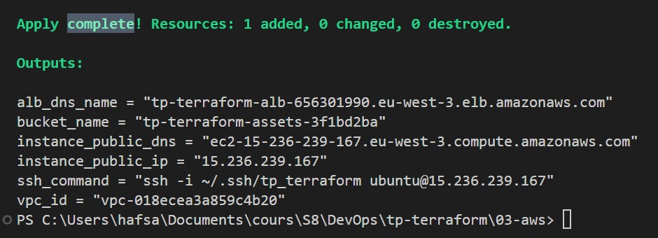
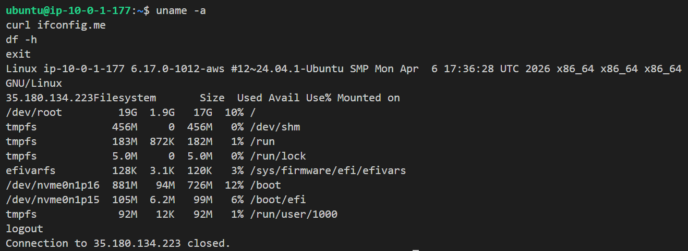

# TP Terraform AWS — Infrastructure Cloud

## 1. Titre, description et noms des membres

### Titre du projet

**TP Terraform AWS — Déploiement d’une infrastructure cloud automatisée**

### Description

Ce projet vise à déployer automatiquement une infrastructure AWS avec Terraform. Dans **`03-aws/`**, l’infra comprend notamment :

* une VPC personnalisée, subnets publics et privés ;
* une instance EC2 Ubuntu, des Security Groups ;
* un Application Load Balancer (ALB) ;
* un bucket S3 (versioning et chiffrement) ;
* une base PostgreSQL RDS (bonus).

Les dossiers **`01-docker/`** et **`02-github/`** introduisent les providers Docker et GitHub avant la partie AWS (LocalStack ou compte réel).

### Membres du groupe

* Hafsa Dini  
* Vainepuana Lemaire  

---

## 3. Prérequis (Terraform, AWS CLI, versions)

### Terraform

* **Terraform** ≥ **1.6** (contrainte déclarée dans les blocs `terraform` du projet).

Vérification :

```powershell
terraform version
```

Exemple attendu :

```txt
Terraform v1.x.x
```

Pour un déploiement sur **LocalStack**, la CLI **LocalStack** et les commandes **`tflocal`** peuvent remplacer `terraform` si ton environnement est configuré ainsi ([documentation LocalStack — Terraform](https://docs.localstack.cloud/user-guide/integrations/terraform/)).

### AWS CLI

Installation puis configuration des identifiants et de la région :

```powershell
aws configure
```

* AWS Access Key ID  
* AWS Secret Access Key  
* Région utilisée pour ce TP : **`eu-west-3`**

Vérification de version :

```powershell
aws --version
```

### Autres prérequis selon les parties du TP

| Partie | Prérequis |
|--------|-----------|
| `01-docker/` | Docker Engine démarré (socket local pour le provider **docker**). |
| `02-github/` | Personal Access Token GitHub, variable `github_token` (ex. via `terraform.tfvars` **non versionné**). |
| `03-aws/` | Compte AWS valide pour un déploiement **réel** ; ressources typiques : EC2, VPC, ALB, S3, RDS, Security Groups. |

---

## 4. Instructions pas à pas pour déployer l’infrastructure

Le déploiement principal se fait dans **`03-aws/`**.

**LocalStack :** utiliser **`tflocal`** à la place de `terraform` si ton TP est calé sur l’émulateur.  
**AWS réel :** utiliser **`terraform`** avec des credentials AWS valides.

### Étape 1 — Cloner le dépôt et aller dans le répertoire AWS

```powershell
git clone <repository-url>
cd tp-terraform/03-aws
```

### Étape 2 — Initialiser Terraform

```powershell
terraform init
```

### Étape 3 — Formater le code

```powershell
terraform fmt
```

### Étape 4 — Valider la configuration

```powershell
terraform validate
```

### Étape 5 — Générer le plan

```powershell
terraform plan
```

### Étape 6 — Appliquer (créer / mettre à jour les ressources)

```powershell
terraform apply
```

Confirmer avec :

```txt
yes
```

### Étape 7 — Consulter les sorties

```powershell
terraform output
```

Exemple de valeurs :

```txt
alb_dns_name = "tp-terraform-alb-822390063.eu-west-3.elb.amazonaws.com"
instance_public_ip = "15.237.74.143"
```

---

## 5. Explication de la structure des fichiers

### Arborescence du dépôt

```txt
tp-terraform/
├── .gitignore
├── .tflint.hcl
├── README.md
├── screenshots/
│   ├── ssh-ec2.png
│   └── terraform-apply.png
├── 01-docker/
│   ├── .terraform.lock.hcl
│   ├── main.tf
│   ├── outputs.tf
│   ├── variables.tf
│   └── versions.tf
├── 02-github/
│   ├── .terraform.lock.hcl
│   ├── main.tf
│   ├── outputs.tf
│   ├── variables.tf
│   └── versions.tf
└── 03-aws/
    ├── .terraform.lock.hcl
    ├── alb.tf
    ├── locals.tf
    ├── main.tf
    ├── outputs.tf
    ├── provider.tf
    ├── rds.tf
    ├── variables.tf
    └── versions.tf
```

Les fichiers **`terraform.tfvars`** (secrets, IP publique, token, etc.) sont **locaux**.

### Rôle des fichiers dans `03-aws/`

| Fichier | Rôle |
|---------|------|
| `main.tf` | Data sources (AZ, AMI), VPC, subnet public, IGW, routes, Security Group, paire de clés, EC2, bucket S3 + versioning + chiffrement. |
| `alb.tf` | Application Load Balancer, listener, target group, enregistrement de la cible EC2. |
| `rds.tf` | Bonus RDS PostgreSQL : subnets privés, subnet group, security group, instance. |
| `variables.tf` | Déclaration des variables. |
| `outputs.tf` | Sorties (IP, DNS ALB, commande SSH, etc.). |
| `provider.tf` | Provider `aws`, région, balises par défaut. |
| `locals.tf` | Locals (ex. type d’instance selon le workspace). |
| `versions.tf` | Versions minimales Terraform et providers. |

---

## 6. Capture d’écran et log de `terraform apply` :

### Capture d’écran



### Exemple de log (apply terminé sans erreur)

```txt
Apply complete! Resources: 24 added, 0 changed, 0 destroyed.
```

Exemple d’outputs après apply :

```txt
alb_dns_name = "tp-terraform-alb-822390063.eu-west-3.elb.amazonaws.com"
bucket_name = "tp-terraform-assets-dcfe4091"
instance_public_ip = "15.237.74.143"
```

---

## 7. Capture d’écran de `la connexion SSH à l’EC2`:

### Capture d’écran



### Commande utilisée (exemple)

```powershell
ssh -i ~/.ssh/tp_terraform ubuntu@15.237.74.143
```

---

## 8. Liste des bonus implémentés

* **TFLint** — analyse statique du code Terraform (fichier `.tflint.hcl` à la racine).  
* **Workspaces Terraform** — séparation des environnements (ex. `terraform workspace new dev` / `select dev`).  
* **Application Load Balancer (ALB)** — listener HTTP, target group, health checks, trafic vers l’EC2.  
* **PostgreSQL RDS** — subnets privés, security group dédié, chiffrement, accès restreint depuis l’EC2.  

---

## 9. Instructions de destruction (`terraform destroy`)

Pour supprimer les ressources gérées par Terraform dans **`03-aws/`** :

```powershell
cd tp-terraform/03-aws
terraform destroy
```

Confirmer avec :

```txt
yes
```

Exemple de résultat :

```txt
Destroy complete! Resources: 24 destroyed.
```

Vérification que le state est vide :

```powershell
terraform state list
```

---

## Annexe — Parcours GitHub, Docker et LocalStack

### Parcours du TP 

1. **Docker** (`01-docker/`) — `resource`, `variable`, `output`, cycle Terraform.  
2. **GitHub** (`02-github/`) — ressources GitHub en HCL.  
3. **AWS** (`03-aws/`) — infra complète ; validation possible sur **LocalStack**, même code adaptable pour **AWS réel**.  

### Partie GitHub (notions)

* dépôts en HCL, branch protection (notion), secrets et GitHub Actions ;  
* mise à jour **in-place** quand l’API le permet ;  
* `terraform import` / `terraform state rm`.  

### Partie Docker (notions)

* dépendances implicites entre ressources ;  
* workflow `init` → `plan` → `apply` → `destroy` ;  
* idempotence ; refactor / state ; snapshot des outputs avant destroy.  

### Bilan LocalStack (validation typique)

* VPC, subnet, IGW, route table ;  
* Security Group (SSH, HTTP, HTTPS) ;  
* key pair, instance EC2 (ex. `t3.micro`) ;  
* bucket S3 avec versioning et chiffrement.  

Passage **AWS réel** : `tflocal` → `terraform`, vraie IP dans `my_ip`, `data "aws_ami"` et `root_block_device` adaptés, clés AWS réelles.  

### Conclusion

Ce TP met en pratique l’Infrastructure as Code avec Terraform (réseau, sécurité, équilibrage de charge, données, cycle apply/destroy), en enchaînant Docker et GitHub avant le déploiement AWS.
